# IBLM

## Installation

IBLM can be installed from CRAN or GitHub:

``` r
# From CRAN
install.packages("IBLM")

# From GitHub
remotes::install_github("IFoA-ADSWP/IBLM")
```

## Introduction

IBLM stands for “Interpretable Boosted Linear Model”.

An IBLM is essentially a hybrid model consisting of two components:

1.  Generalised Linear Model (GLM) - fitted to the training data

2.  Booster Model[¹](#fn1) - fitted to the residuals of the training
    data against GLM predictions in step 1.

The purpose of this article is to show you how to use IBLM to train,
explain and predict using functions from this package.

``` r
library(IBLM)
```

## Theory

The overall process for fitting and interpreting an IBLM is as follows:

**Step 1: Fit a GLM**

$$g(\mu) = \beta_{0} + \beta_{1}x_{1} + \beta_{2}x_{2} + \cdots + \beta_{n}x_{n}$$

Where g(·) is the link function, μ is the expected value of the
response, and β values are your standard regression coefficients.

$$\text{GLM prediction} = g^{- 1}\left( \beta_{0} + \beta_{1}x_{1} + \beta_{2}x_{2} + \cdots + \beta_{n}x_{n} \right)$$

Where β values are your standard regression coefficients.

**Step 2: Train a Booster on GLM’s Errors**

Train a booster model (i.e. XGBoost) on the residuals of the actual
response values against the GLM predictions.

**Step 3: Use SHAP to Break Down the Booster**

SHAP decomposition allows the booster’s prediction to be apportioned
into contributions from each feature:

$$\text{Booster prediction} = g^{- 1}\left( \varphi_{0} + \varphi_{1}(x) + \varphi_{2}(x) + \cdots + \varphi_{n}(x) \right)$$

Where $\varphi_{j}(x)$ is how much feature j contributed to a specific
prediction.

**Step 4: Convert SHAP Values to Beta Coefficient Corrections**

Transform each SHAP contribution into beta corrections:

$$\alpha_{j}(x) \approx \frac{\varphi_{j}(x)}{x_{j}}$$

There are two situations where the value of $\alpha_{j}(x)$ is set to
zero and the value for $\varphi_{j}(x)$ is added to the intercept
instead. This is when $x$ is a numerical variable, and the value is
zero. Or, when $x$ is a categorical variable, and the value is that of
the reference level[²](#fn2).

$$\begin{aligned}
{\alpha_{j}(x)} & {= 0{\mspace{6mu}\text{when}\mspace{6mu}}\begin{cases}
{x_{j} = 0} & \text{(numerical)} \\
{x_{j} = \text{ref}} & \text{(categorical)}
\end{cases}} \\
{\alpha_{0}(x)} & {= \sum\limits_{\substack{j:x_{j} = 0 \\ {\text{or}\mspace{6mu}}x_{j} = \text{ref}}}\varphi_{j}(x)}
\end{aligned}$$

**Step 5: Combine**

The final IBLM can be interpreted as a collection of adjusted GLMs. Each
row of the data will essentially have its own GLM coefficients. These
are the addition of:

1.  The GLM coefficients derived in step 1, which are the same for all
    rows

2.  The beta corrections derived in step 4, which are unique to that
    predictor variable combination.

$$g(\mu) = \left( \beta_{0} + \varphi_{0} + \alpha_{0} \right) + \left( \beta_{1} + \alpha_{1}(x) \right)x_{1} + \left( \beta_{2} + \alpha_{2}(x) \right)x_{2} + \cdots + \left( \beta_{n} + \alpha_{n}(x) \right)x_{n}$$

or

$$\begin{aligned}
{g(\mu)} & {= \beta\prime_{0} + \beta\prime_{1}x_{1} + \beta\prime_{2}x_{2} + \cdots + \beta\prime_{n}x_{n}} \\
{{\text{where}\mspace{6mu}}\beta\prime_{j}} & {= \beta_{j} + \alpha_{j}(x)} \\
{{\text{and}\mspace{6mu}}\beta\prime_{0}} & {= \beta_{0} + \varphi_{0} + \alpha_{0}}
\end{aligned}$$

Where g(·) is the link function, μ is the expected value of the
response, and β values are your standard regression coefficients.

The IBLM prediction is a combination of components.

$$\begin{aligned}
\text{IBLM prediction} & {= g^{- 1}\left( \beta\prime_{0} + \beta\prime_{1}x_{1} + \beta\prime_{2}x_{2} + \cdots + \beta\prime_{n}x_{n} \right)} \\
 & {= \begin{cases}
{\text{GLM prediction} \times \text{Booster prediction}} & {{\text{when}\mspace{6mu}}g = \log} \\
{\text{GLM prediction} + \text{Booster prediction}} & {{\text{when}\mspace{6mu}}g = \text{identity}}
\end{cases}}
\end{aligned}$$

This preserves the familiar GLM form while incorporating the booster’s
superior predictive power.

## Train

To train an IBLM we must get our data into an appropriate format. In
this document our demonstrations will be completed using French motor
claims dataset `freMTPL2freq`.

Data for training an IBLM model must be in the form of a list of 3
dataframes. These will be named “train”, “validate” and “test”. The
function
[`split_into_train_validate_test()`](https://ifoa-adswp.github.io/IBLM/reference/split_into_train_validate_test.md)
can conveniently split a single dataframe into such a structure.

``` r
df <- load_freMTPL2freq()

df <- df |> mutate(ClaimNb = round(ClaimNb))

df_list <- df |> split_into_train_validate_test(seed = 1)
```

There is currently only one function available to train an IBLM. This is
[`train_iblm_xgb()`](https://ifoa-adswp.github.io/IBLM/reference/train_iblm_xgb.md)
which will use xgboost as the booster model. This performs steps 1 and 2
of the [Theory](#theory).

The output is of class “iblm”. Objects of this class contain two
component models “glm_model” and “booster_model”. There are also other
items containing information (see Value section of
[`train_iblm_xgb()`](https://ifoa-adswp.github.io/IBLM/reference/train_iblm_xgb.md)
for more information)

``` r
iblm_model <- train_iblm_xgb(
  df_list,
  response_var = "ClaimNb",
  family = "poisson"
)

class(iblm_model)
#> [1] "iblm"
```

For convenience, it is also possible to train an XGBoost model using the
same settings that were used for you model of class “iblm”. This can be
useful when directly comparing (for example see [Pinball
Score](#pinball-score))

``` r
xgb_model <- train_xgb_as_per_iblm(iblm_model)

is_identical_config <- purrr::map2_lgl(
  xgboost::xgb.config(xgb_model) |> unlist(),
  xgboost::xgb.config(iblm_model$booster_model) |> unlist(),
  identical
) 

# the config is mostly identical. In our example the differences are:
is_identical_config[!is_identical_config] |> names()
#> [1] "learner.generic_param.random_state"                   
#> [2] "learner.generic_param.seed"                           
#> [3] "learner.gradient_booster.gbtree_model_param.num_trees"
```

## Explain

Code to explain and interpret an object of class “iblm” are conveniently
wrapped in the
[`explain_iblm()`](https://ifoa-adswp.github.io/IBLM/reference/explain_iblm.md)
function. This performs steps 3, 4 and 5 of the [Theory](#theory). The
values derived are all based on the data fed in, which would usually be
the test portion of your dataset.

The following line is all that is required:

``` r
ex <- explain_iblm(iblm_model, df_list$test)
```

The output object is a list containing the following items:

- **beta_corrected_scatter** Function to create scatter plots showing
  SHAP corrections vs variable values (see
  [`beta_corrected_scatter()`](https://ifoa-adswp.github.io/IBLM/reference/beta_corrected_scatter.md))

- **beta_corrected_density** Function to create density plots of SHAP
  corrections for variables (see
  [`beta_corrected_density()`](https://ifoa-adswp.github.io/IBLM/reference/beta_corrected_density.md))

- **bias_density** Function to create density plots of SHAP corrections
  migrated to bias (see
  [`bias_density()`](https://ifoa-adswp.github.io/IBLM/reference/bias_density.md))

- **overall_correction** Function to show global correction
  distributions (see
  [`overall_correction()`](https://ifoa-adswp.github.io/IBLM/reference/overall_correction.md))

- **shap** Dataframe showing raw SHAP values of data records. These are
  the $\varphi_{n}(x)$ values described in step 3 of [Theory](#theory).

- **beta_corrections** Dataframe showing beta corrections (in
  wide/one-hot format) of data records. These are the $\alpha_{0}(x)$
  and $\alpha_{j}(x)$ values described in step 4 of [Theory](#theory).

- **data_beta_coeff** Dataframe showing corrected beta coefficients of
  data records. These are the $\beta\prime_{0}$ and $\beta\prime_{j}$
  values described in step 5 of [Theory](#theory). For categorical
  variables, the value corresponds to the relevant coefficient for that
  datapoint.

Many of the items output are functions. The functions can then be called
to observe the components of the “iblm” object in different ways.

### Beta Corrected Density

The corrected beta coefficients (β’ⱼ) can be observed in a density plot.
This plotting function allows the user to see corrected beta coefficient
values for a particular variable.

The density plot also shows the standard error for the original beta
coefficient, fitted in the GLM model component. This can be useful to
understanding the significance of the range in corrected beta
coefficients.

#### Numerical Variables

For numerical variables, calling the function creates a single plot.
Below we show examples with different numerical variables from our
freMTPL2freq dataset.

### 

- VehPower
- VehAge
- DrivAge
- BonusMalus

``` r
ex$beta_corrected_density(varname = "VehPower")
```

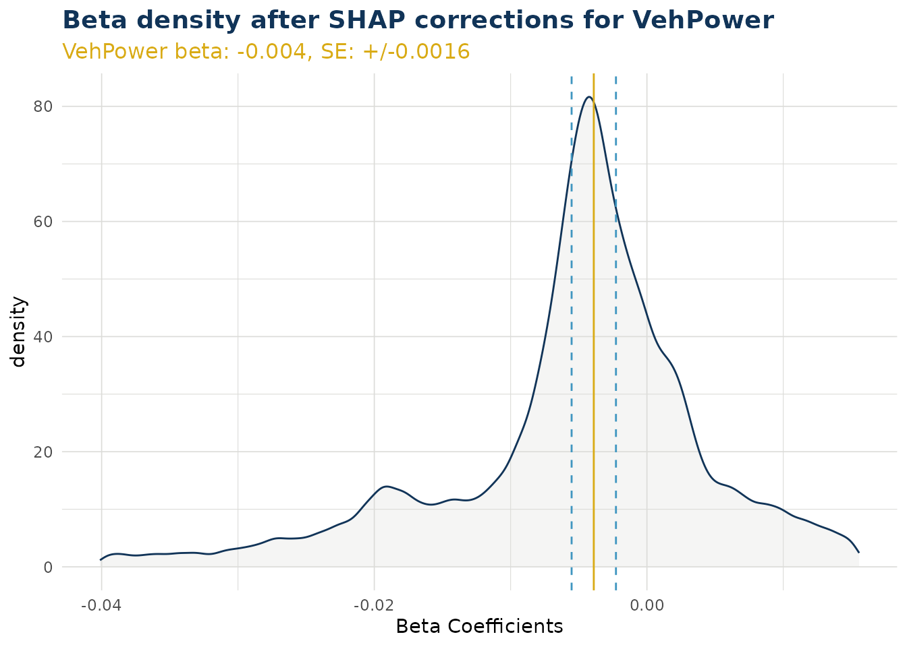

``` r
ex$beta_corrected_density(varname = "VehAge")
```

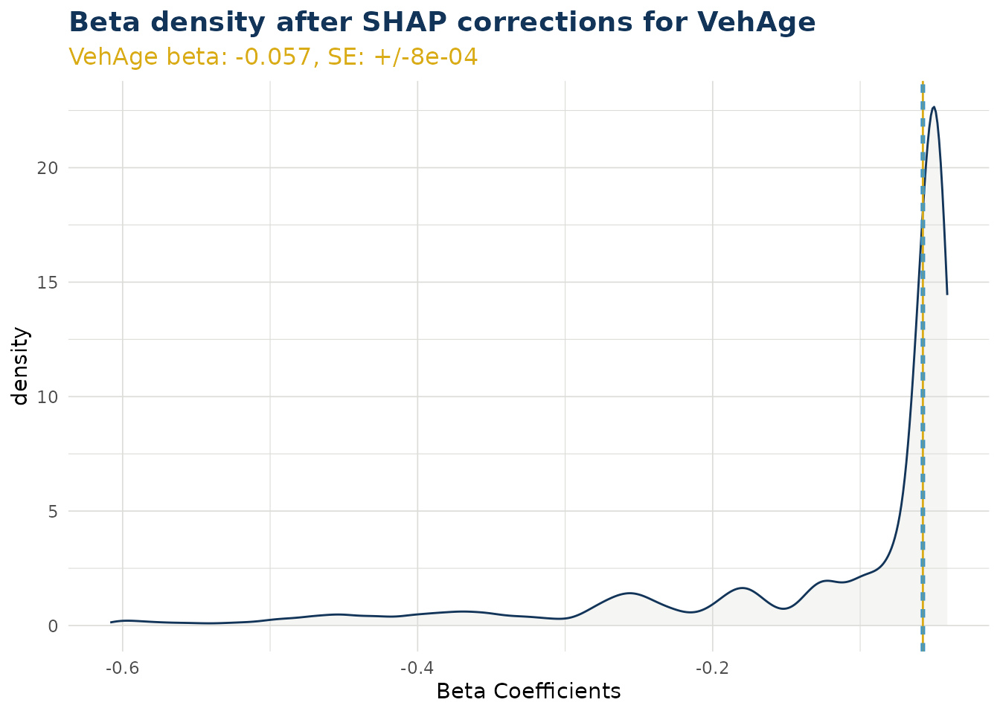

``` r
ex$beta_corrected_density(varname = "DrivAge")
```

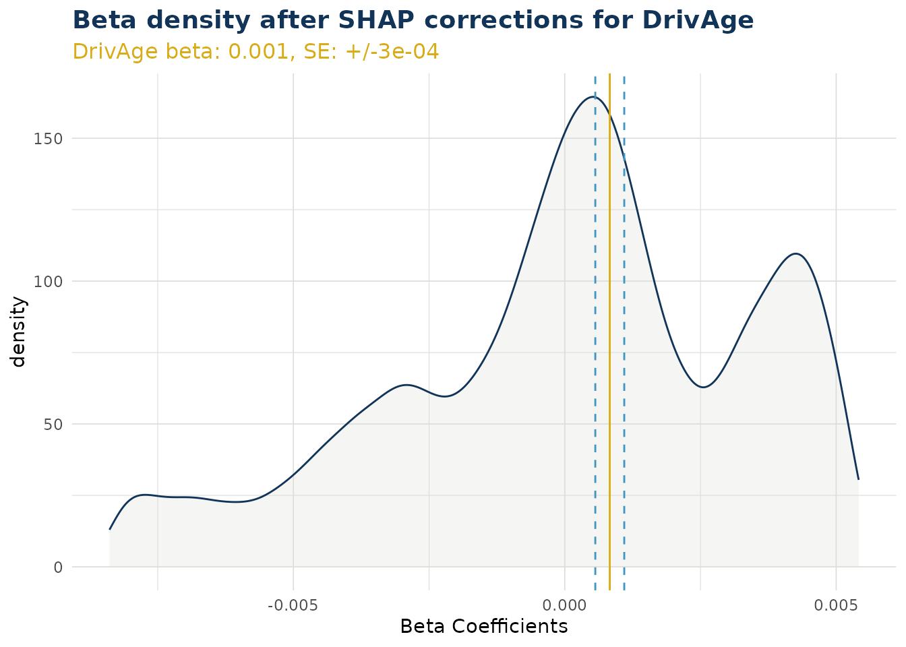

``` r
ex$beta_corrected_density(varname = "BonusMalus")
```

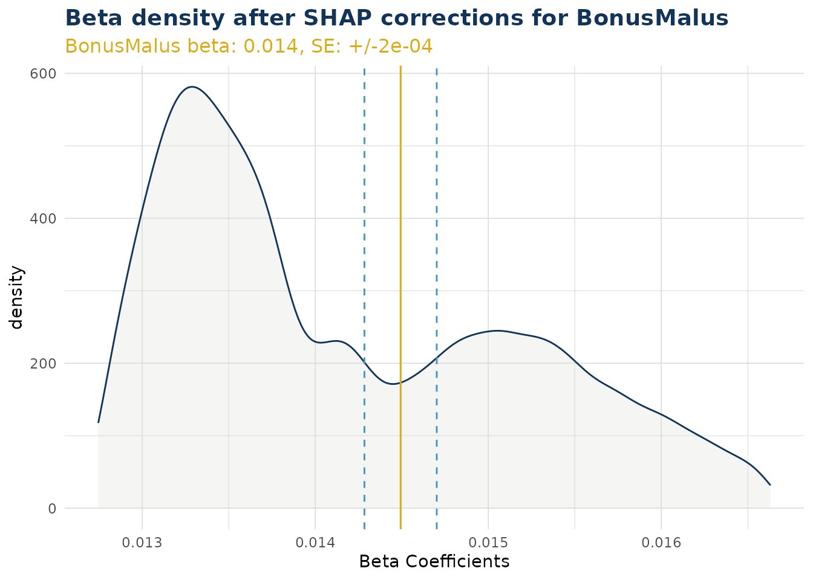

### 

#### Categorical Variables

For categorical variables, calling the function creates a **list** of
ggplot objects. A separate plot is produced for each level of that
categorical variable. Note this does not include the reference level.

In the example below “VehBrand” has 11 levels and produces 10 plots.
Level “B1” was a reference level and does not have a beta coefficient
within the GLM component. Instead, for “B1”, the SHAP values are
migrated to the bias (see [Bias Corrected
Density](#bias-corrected-density)). Also in the example, we have wrapped
our list using patchwork to create a single graphic for simplicity.

``` r
VehBrand <- ex$beta_corrected_density(varname = "VehBrand", type = "hist")

VehBrand |> patchwork::wrap_plots(ncol = 2) 
```

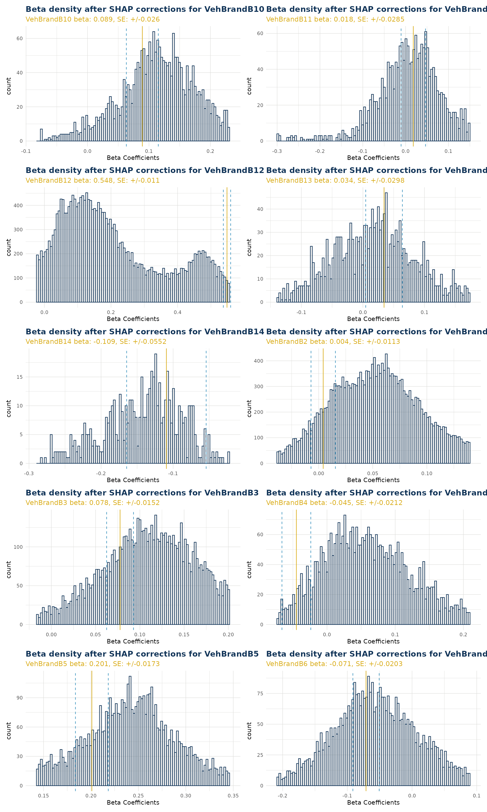

### Beta Corrected Scatter

The corrected beta coefficients (β’ⱼ) can be observed in a scatter plot
(or boxplot). This plotting function allows the user to see corrected
beta coefficient values for a particular variable and the relationship
to that particlar variable value.

#### Numerical Variables

When varname is set to a numerical variable, a scatter plot is produced.
The example below shows the relationship of corrected beta coefficient
values against driver age. Note that the original beta coefficient
fitted to the GLM component is shown by a dashed black line (and stated
near the top of the plot in orange). We can see that corrected beta
coefficients can be materially different. There is also a smoothed trend
line fitted that shows the overall pattern of correction.

Note the color argument can also be set to try and observe interactions
with a second variable.

``` r
ex$beta_corrected_scatter(varname = "DrivAge", color = "VehPower")
#> `geom_smooth()` using method = 'gam' and formula = 'y ~ s(x, bs = "cs")'
```

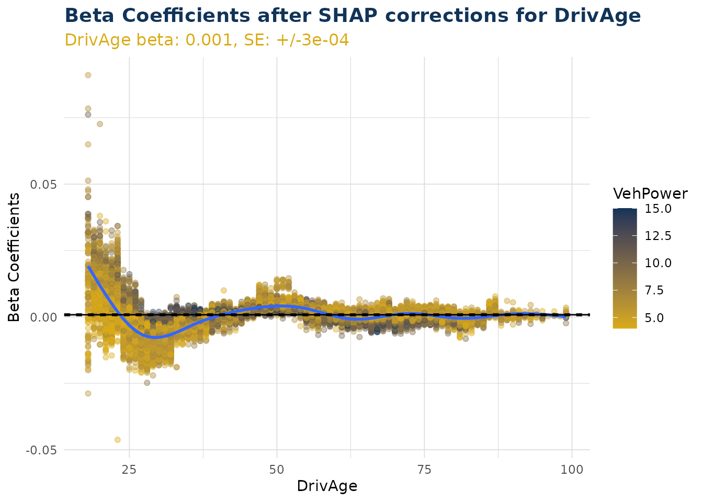

#### Categorical Variables

When varname is set to a categorical variable, a boxplot is produced.
This shows the distribution for each individual level within that
categorical variable.

Note the color argument can also be set to try and observe interactions
with a second variable.

``` r
ex$beta_corrected_scatter(varname = "VehBrand")
```

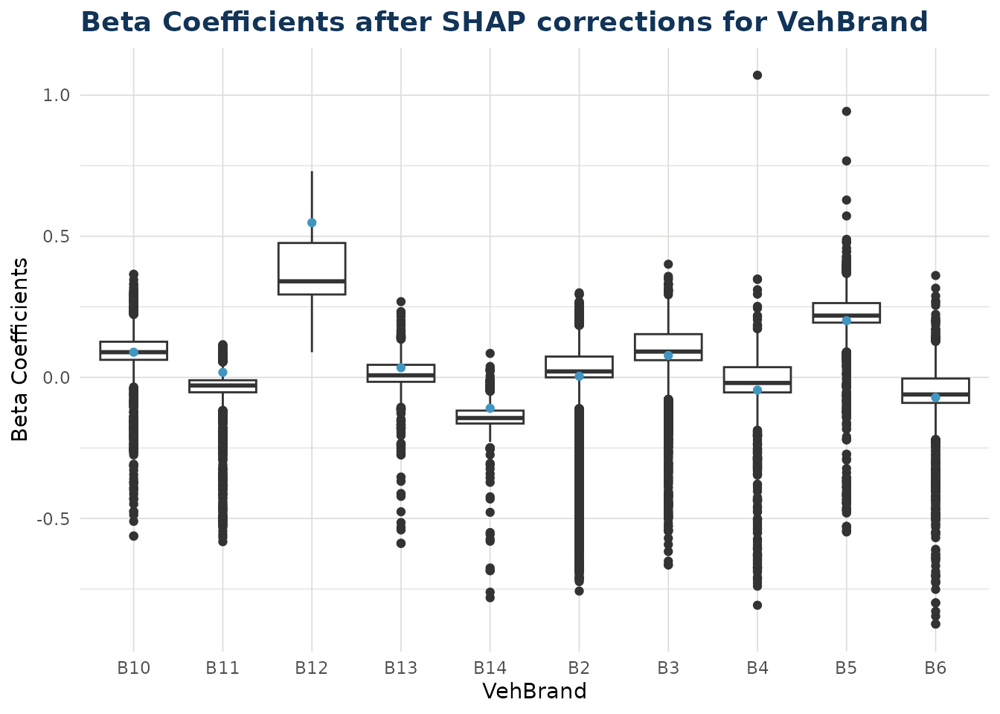

### Bias Corrected Density

As described in step 4 of [Theory](#theory), some shap values cannot be
translated to beta corrections. These values are instead migrated to the
bias. There are two situations where this can occur:

1.  Numerical variable where the value was zero for that data point.
2.  Categorical variable where the value was the reference level for
    that data point.

In the `bias_correction_var` plot we visualise all the individual times
this occured in our test dataset. For categorical variables Area,
Region, VehBrand and VehGas the total counts in the repsective facets of
the histogram will equal the total occurences of the reference level for
that variable. For numerical variable VehAge the total count in that
facet will equal the total occurences of zero for VehAge in the dataset.
Other numerical variables are dropped from the plot as they had no
instances of zero value (for example DrivAge)

The `bias_correction_total` plot is the cumulative sum of these
components across each data point. Note any data point with no bias
migration (i.e. conditions 1 and 2 do not occur) will have the standard
bias adjustment and is not counted in the plot. The standard bias value,
along with standard error around this, can be observed as the straight
blue line and dashed orange lines either side.

The bias values can be observed with
[`bias_density()`](https://ifoa-adswp.github.io/IBLM/reference/bias_density.md).

### 

- Variable
- Total

``` r
bias_corrections <- ex$bias_density()
bias_corrections$bias_correction_var
```

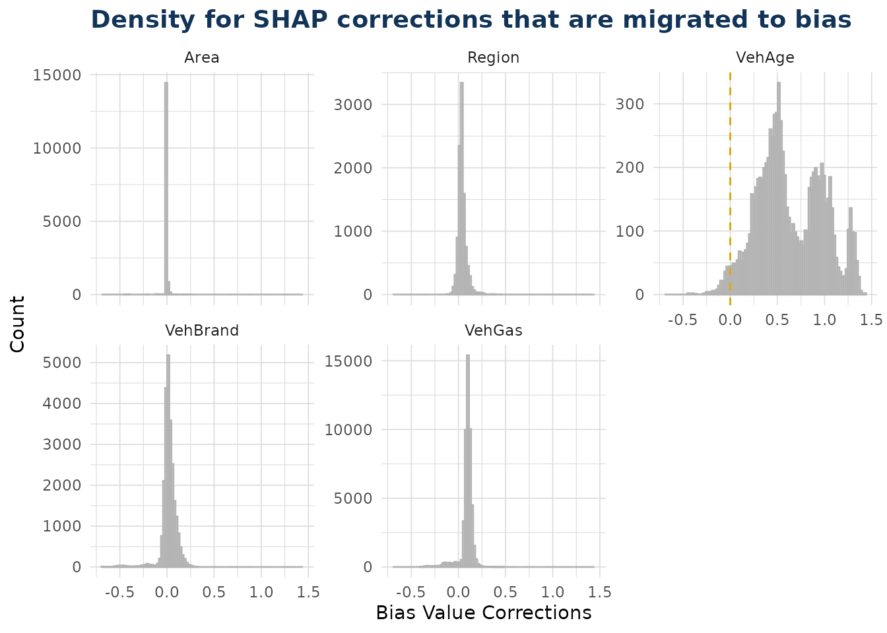

``` r
bias_corrections <- ex$bias_density()
bias_corrections$bias_correction_total
```

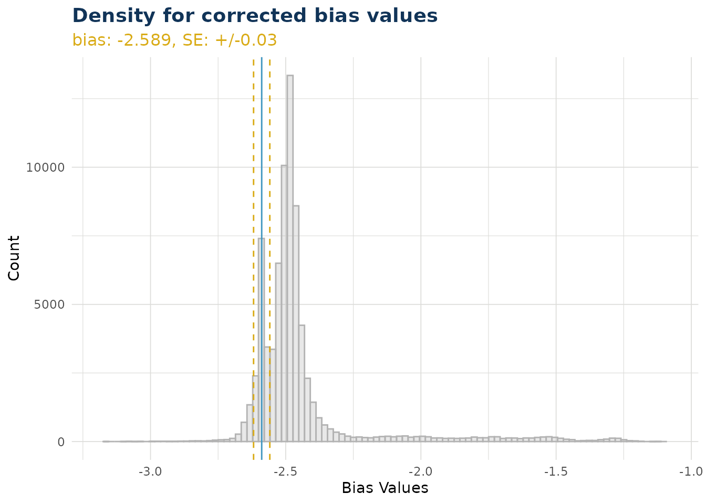

### 

### Overall Correction

The distribution of overall corrections across your test data can be
observed. If the link function is log then the correction is a
multiplier (as is the case below). If the link function is identity,
then the overall correction is an addition. By default the x scale is
transformed by the link function, but this can be switched off.

### 

- Link Transformed
- Not transformed

``` r
ex$overall_correction()
```

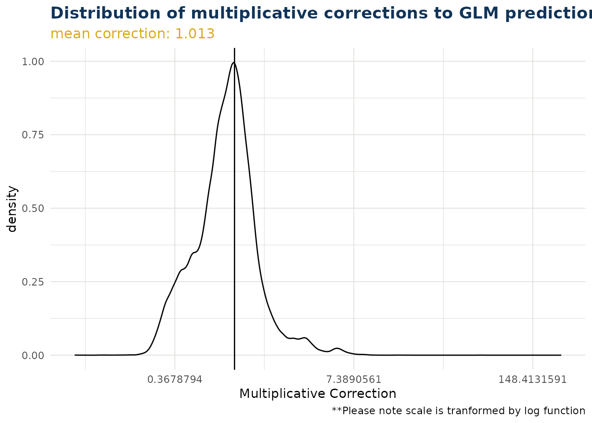

``` r
ex$overall_correction(transform_x_scale_by_link = FALSE)
```

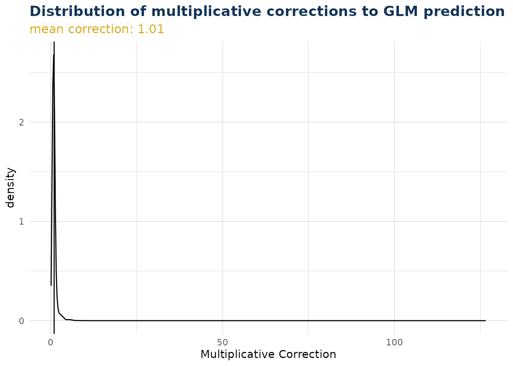

### 

## Predict

The package contains a predict method for the class “iblm”. This employs
the [`predict()`](https://rdrr.io/r/stats/predict.html) method of both
the “glm_model” and “booster_model” items within the “iblm” class
object.

``` r
predictions <- predict(iblm_model, df_list$test)
```

The predict method contains an option to trim. This truncates the values
of the booster model predictions to prevent extreme deviation from the
foundation GLM. This is explored further in [Correction
Corridor](#correction-corridor).

Because IBLM is essentially a collection of GLMs, and the corrected beta
coefficients are derived by the
[`explain_iblm()`](https://ifoa-adswp.github.io/IBLM/reference/explain_iblm.md)
function, it is also possible to predict through linear calculation.

``` r
coeff_multiplier <- 
  df_list$test |>
  select(-all_of("ClaimNb")) |>
  mutate(
    across(
      all_of(iblm_model$predictor_vars$categorical),
      ~1
      )
    ) |>
  mutate(bias = 1, .before = 1)

predictions_alt <- 
  (ex$data_beta_coeff * coeff_multiplier) |>
  rowSums() |> 
  exp() |>
  unname()

# difference in predictions very small between two alternative methods
range(predictions_alt / predictions - 1)
#> [1] -1.422597e-06  8.286781e-07
```

### Pinball Score

The pinball score is a way to measure the performance of the models. It
shows the increase (or decrease when negative) of predictability
compared to using the training data mean instead.

In the example below, we see the iblm has increased score compared to
the glm. We have also added the xgb_model (derived in section
[Train](#train)) as a further comparison.

``` r
get_pinball_scores(
  data = df_list$test, 
  iblm_model = iblm_model,
  additional_models = list(xgb = xgb_model)
  ) |> 
  gt() |> 
  fmt_percent("pinball_score")
#> Warning in FUN(X[[i]], ...): NAs introduced by coercion
#> Warning in FUN(X[[i]], ...): NAs introduced by coercion
#> Warning in FUN(X[[i]], ...): NAs introduced by coercion
#> Warning in FUN(X[[i]], ...): NAs introduced by coercion
```

| model | poisson_deviance | pinball_score |
|-------|------------------|---------------|
| homog | 1.407148         | 0.00%         |
| glm   | 1.348394         | 4.18%         |
| iblm  | 1.238663         | 11.97%        |
| xgb   | 1.363077         | 3.13%         |

### Correction Corridor

As described in [Predict](#predict) it is possible to trim the
contribution from the booster component of an iblm object when
predicting. This prevents estimates deviating too far from the GLM
foundational model.

The correction corridor function applies
[`predict.iblm()`](https://ifoa-adswp.github.io/IBLM/reference/predict.iblm.md)
with different settings of trim, and plots the results. It is also
possible to set the color to a variable to observe any patterns. Note
that when the trim value is zero, the IBLM predictions are the same as
the GLM predictions.

``` r
correction_corridor(
  iblm_model, 
  df_list$test,
  trim_vals = c(0.5, 0),
  sample_perc = 0.1,
  color = "DrivAge")
```

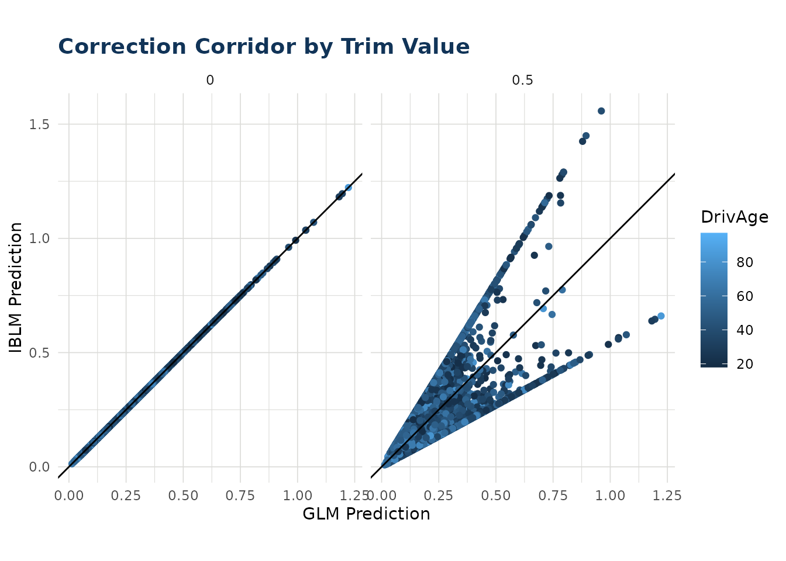

------------------------------------------------------------------------

1.  As of v.1.0.0 the IBLM package can only fit a booster model of type
    XGBoost, however we are looking to add other options in the future.

2.  The reference level of a categorical variable is the value that is
    the value for which there is no coefficient in the GLM. The
    reference levels of an “iblm” class object can be found in
    `.$cat_levels$reference`
